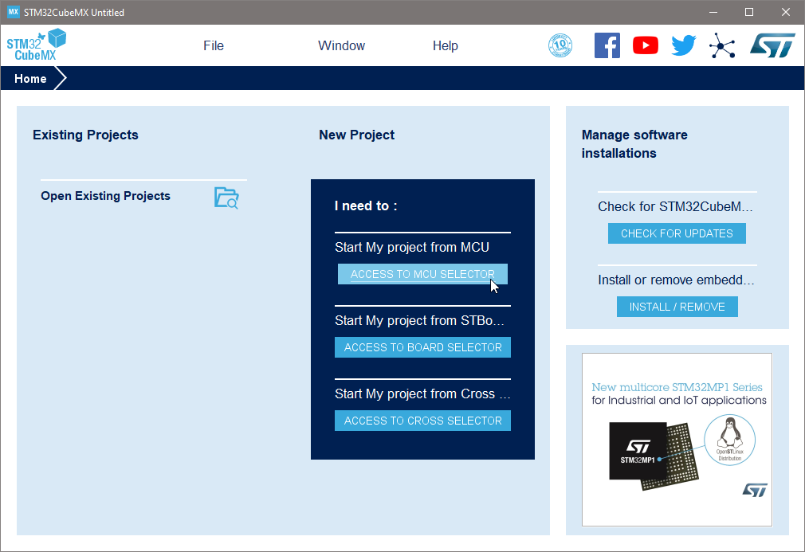
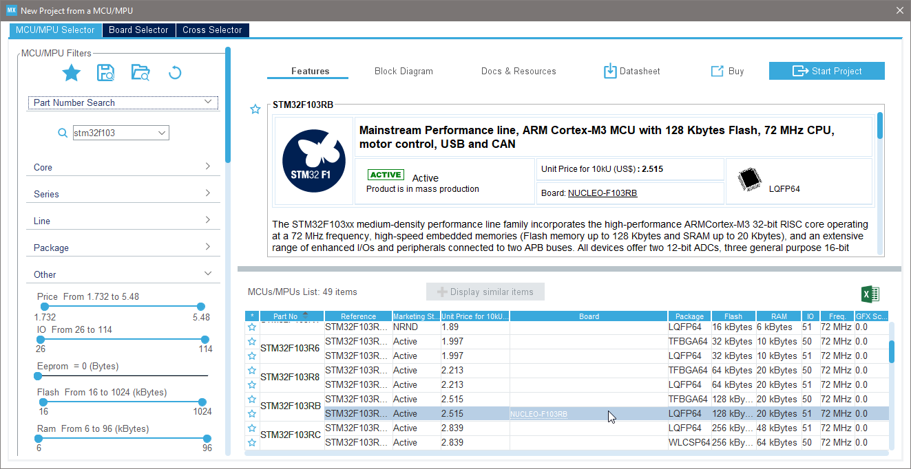
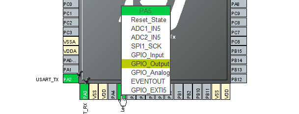
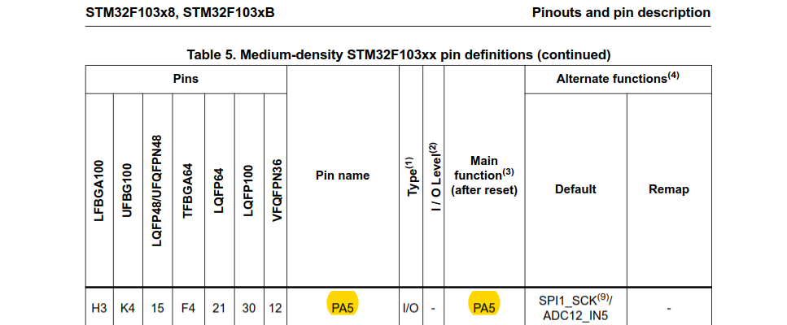
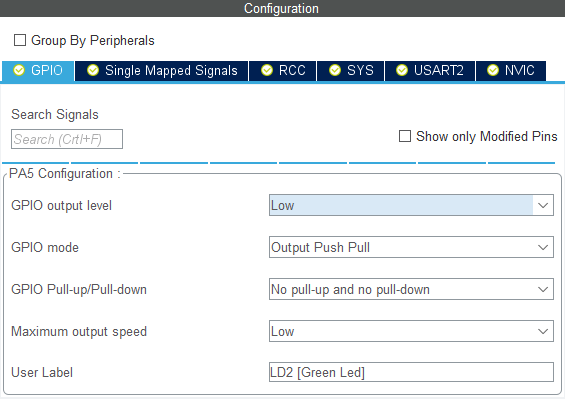
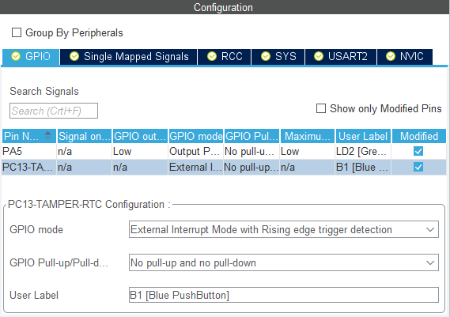
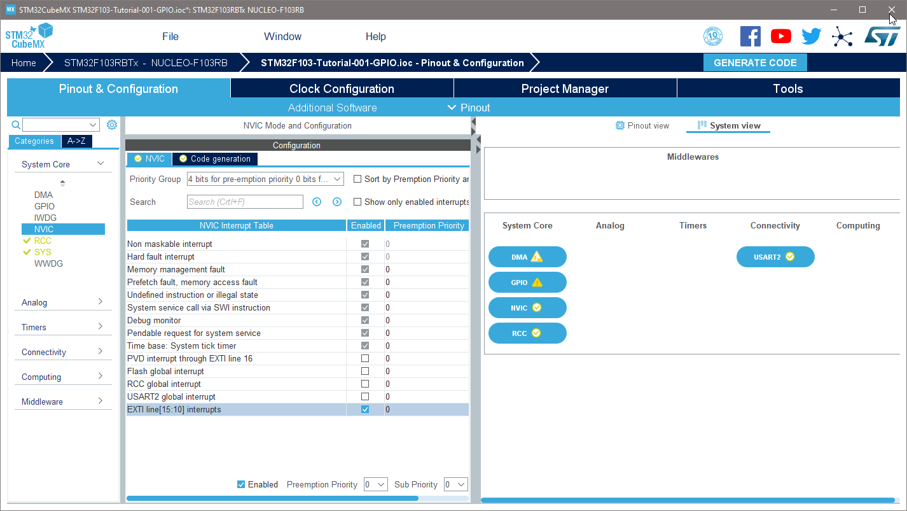
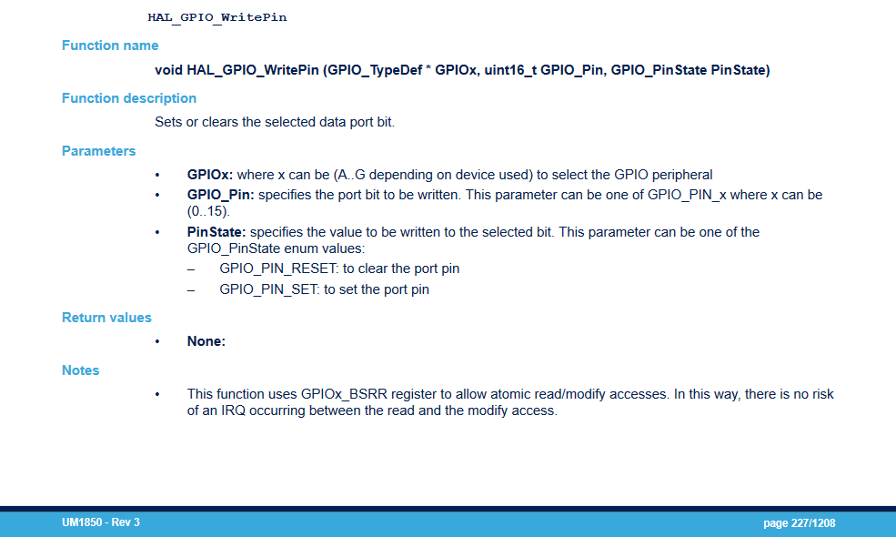
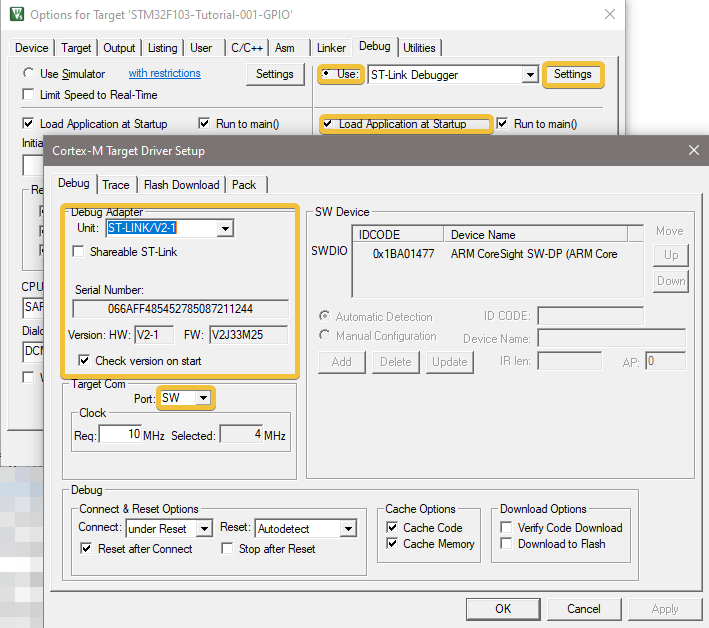

# STM32 Tutoriall 001 - GPIO Operations

Embedded Software Programming on the STM32 Plattform

---

You can use the STM32CubeMX software to create the necessary configuration files to enable the GPIO Pins. 
In this tutorial I’m going to explain how you can create and modify the GPIO configuration and how to use it in the code.

## Requirements

You need any of the **STM32-Nucleo 64 boards**. I am going to use the `STM32f103rb` board in this tutorial. You should also have an the **STM32CubeMX** Configurator and a compatible IDE installed. Check Tutorial 000 for installation instructions. It is also handy if you happen to have the User Manual of the Nucleo-64 board and the datasheet for the STM32 microcontroller nearby.

- [STM32 NUCLEO-F103RB](https://www.st.com/en/evaluation-tools/nucleo-f103rb.html)
- [STM32F103c8 Datasheet](https://www.st.com/resource/en/datasheet/stm32f103c8.pdf)
- STM32 Nucleo-64 boards User Manual **[UM1724](https://www.st.com/content/ccc/resource/technical/document/user_manual/98/2e/fa/4b/e0/82/43/b7/DM00105823.pdf/files/DM00105823.pdf/jcr:content/translations/en.DM00105823.pdf)** (pdf)
- Description of **STM32F1** HAL and low-layer drivers **[UM1850](https://www.st.com/content/ccc/resource/technical/document/user_manual/72/52/cc/53/05/e3/4c/98/DM00154093.pdf/files/DM00154093.pdf/jcr:content/translations/en.DM00154093.pdf)** (pdf)
- STM32CubeMX installed
- arm Keil µVision 5 IDE installed

---

This tutorial comes with the following source code files

- [STM32F103-Tutorial-001-GPIO.ioc](src/STM32F103-Tutorial-001-GPIO.ioc) (STM32CubeMX project file)
- [`main.c`](src/main.c)
- [`stm32f1xx_it.c`](src/stm32f1xx_it.c)

---

## Getting Started



- On the startup window, click on `MCU Selector` or `Board Selector`.



- Select your MCU or Nucleo board from the list.
- Click on **`Start Project`**
- Click **`Yes`** on the **`Initialize all peripherals with their default Mode?`** dialogue (Nucleo boards only)

The last one will initialize the peripherals to the default mode of the Nucleo / Discovery boards. These settings sometimes depend on the external hardware (e.g. external clock frequency).


- name your project under `Project Manager`
- The toolchain needs to match your IDE: for Keil µVision 5 choose: **`MDK-ARM V5`**
- `Ctrl` + `S` to save the project

---

## Default Settings explained

When you go back to the `Pinout & Configuration` panel you will notice a few default settings.

#### Clock Source

Under `System Core` / `RCC` you will see, that the `High Speed Clock (HSE)` is enabled. This means that the STM32 will use an external clock source.


However, if you check the schematics of the Nucleo-64 boards ([UM1724](https://www.st.com/content/ccc/resource/technical/document/user_manual/98/2e/fa/4b/e0/82/43/b7/DM00105823.pdf/files/DM00105823.pdf/jcr:content/translations/en.DM00105823.pdf), page 64/69) you will see, that the external clock `X3` is not present on the Nucleo board (`[N/A]`).

Furthermore, the `Low Speed Clock (LSE)` is also enabled. This clock is usually a _32.768kHz_ clock used for real time clock (RTC) application.
This external clock `X2` is not present on the Nucleo.


--- 

### Debug Interface

Under `System Core` / `SYS` you will see, that the `Debug`-interface is enabled as `Serial Wire`. This is the connection to the on-board STLink/V2 debug interface. It uses three pins `PB3` (`SWO`), `PA13` (`TMS`) and `PA14` (`TCK`).

---

### GPIO Pins

Since the Nucleo boards have a `User Button` (blue) and a `User LED` on the board, these two pins are initialized by default.

> Note, that you can give each GPIO pin a new name by changing the `User Label` property. This name is later available in the code as a defined value for the `Port` and `Pin`.

Under `System Core` / `GPIO` you will see, the two GPIOs initialized already.

---

#### GPIO Output / User LED

If you click on the physical pin `PA5` on the `LQFP64` package, you will see all available pin functions. The default selected function is `GPIO_Output` which means that the GPIO is simply a digital output.



The other available functions match the pin functions in the datasheet:



The [STM32F103c8 Datasheet](https://www.st.com/resource/en/datasheet/stm32f103c8.pdf) states on page 29/117 in Table 5 the available pin functions on `PA5`. As you can see, the pin `PA5` can also be used as `SPI1_SCK` or `ADC12_IN5`.

On the left, you will see that the LED Pin is initialized as `Open Push Pull`. 



**Properties**

- `GPIO output level` can invert the output logic (active high / active low)
- `GPIO mode` sets the internal hardware connection (push pull / open drain)

---

#### GPIO Input / User Button

If you click on the physical pin `PC13` on the `LQFP64` package, you will see all available pin functions. The default selected function is `GPIO_EXTI13` which means that the GPIO is connected to the external interrupt channel 13.


> Note, that any GPIO can be an interrupt pin. The STM32 has 16 available EXTI channels. As a hardware developer you need to keep track of the port numbers.
For example, `EXTI13` (channel 13) can be any GPIO port but only port number 13. If you were to use `PA0` and `PB0` as an external interrupt source, this would not work, since both pins would connect to `EXTI0` (channel 0).

Further reading: 
- [embedded-lab.com/blog/stm32-external-interrupt](http://embedded-lab.com/blog/stm32-external-interrupt/)
- [stm32f4-discovery.net/2014/08/stm32f4-external-interrupts-tutorial](https://stm32f4-discovery.net/2014/08/stm32f4-external-interrupts-tutorial/)

On the left, you will see that the button is initialized as `External Interrupt Mode with Rising edge trigger detection`. I will later explain, how to use GPIO interrupts. If the button is configured as an interrupt pin, it can still be read like a regular GPIO. This is why I leave this unchanged.



**Properties**

- `GPIO mode` sets interrupt beaviour (rising, falling edge detection)

Furthermore, you need to enable the external GPIO interrupts in the `NVIC` section of the configurator.



Check the `EXTI line [0:15] interrupts`. This will generate interrupt callback functions in the software project.


---

### Project Generation

- on the top right corner, click on `GENERATE CODE`

This will initialize a full Keil µVision 5 project structure and prompt you to open the IDE afterwards. 

- Confirm the prompt with `Open Project`.

---

### Programming in Keil µVision 5

You should see the following project structure. Open the `main.c` file.


> **Note**, you must only write code within the `/* USER CODE BEGIN x */` and `/* USER CODE END x */` comments. If you write code anywhere else it will be overriden when you rebuild the project from the STM32CubeMX Software.

> **Note**, that you have reserved space to place your own custom code. 
> Place your includes after `/* USER CODE BEGIN Includes */`, 
> define your variables after `/* USER CODE BEGIN PV */`, and so on...

---

#### Blink the LED

Scroll down to the `int main(void)` section of the programm.

Type `HAL_GPIO_` and press `Ctrl` + `Space` to get recommendations on what functions are available. You will find one that sounds like it can change the pins state of a GPIO.


Let's choose this `HAL_GPIO_WritePin` and add the following lines of code within the `while (1)` loop **after** the `/* USER CODE BEGIN 3 */` comment.

```c
  /* USER CODE BEGIN WHILE */
  while (1)
  {
    /* USER CODE END WHILE */
    
    /* USER CODE BEGIN 3 */
    HAL_GPIO_WritePin(LD2_GPIO_Port, LD2_Pin, GPIO_PIN_SET);  // LED on
    HAL_Delay(500);
    HAL_GPIO_WritePin(LD2_GPIO_Port, LD2_Pin, GPIO_PIN_SET);  // LED off
    HAL_Delay(500);
  }
  /* USER CODE END 3 */
```

This is one way to let an LED blink.

Consult the HAL Reference manual ([UM1850](https://www.st.com/content/ccc/resource/technical/document/user_manual/72/52/cc/53/05/e3/4c/98/DM00154093.pdf/files/DM00154093.pdf/jcr:content/translations/en.DM00154093.pdf)) to read the documentation to the HAL GPIO functions.
Chapter 20 on page 225/1208 deals with GPIO functions.
On page 227/1208 the `HAL_GPIO_WritePin` function is documented.



On the next page of the documentation you will find a more suitable function named `HAL_GPIO_TogglePin `.

You could write the above blink example like this:

```c
  /* USER CODE BEGIN WHILE */
  while (1)
  {
    /* USER CODE END WHILE */
    /* USER CODE BEGIN 3 */
    HAL_GPIO_TogglePin(LD2_GPIO_Port, LD2_Pin);  // toggle LED on/off
    HAL_Delay(500);
  }
  /* USER CODE END 3 */
```
---

#### Compile and Upload

Connect your STM32 Nucleo board to the computer.

Go to `Project > Options for Target 'STM32F103...'` or press `Alt` + `F7`.

Check that your STM32 Nucleo board / STLink/V2 is detected and has the following settings.



To compile the written code, press `F7`.
(Compiling for the first time after building the project with STM32CubeMX takes a little longer than compiling just the `main.c`.)

To upload the code to your board, press `F8`.

Done! The LED on your board should now be blinking.

---

#### Blink the LED

Now you can also change the code to react to the User Button.
For example, you could write this:

```c
  /* USER CODE BEGIN WHILE */
  while (1)
  {
    /* USER CODE END WHILE */

    /* USER CODE BEGIN 3 */
    GPIO_PinState state = HAL_GPIO_ReadPin(B1_GPIO_Port, B1_Pin);
    HAL_GPIO_WritePin(LD2_GPIO_Port, LD2_Pin, state);
    HAL_Delay(10);
  }
  /* USER CODE END 3 */
```

Compile and upload this code to your board (`F7` then `F8`).

When you press the blue User Button, the LED should change accordingly.

#### GPIO Interrupts

So what about the GPIO Interrupts then?

On the left side in the project folder, open the file **`stm32f1xx_it.c`**.
This file contains callback functions for all the enabled interrupt handlers.
Scroll down to the following handler:


Here you see a callback function for the EXTI interrupt channels 10 to 15.
So each time an interrupt on channel 10, 11, 12, 13, 14 or 15 occurs, this function is called. In order to filter for our `EXTI13` interrupt you need the `__HAL_GPIO_EXTI_GET_FLAG` macro.

Full code for this example:

**in `main.c`**

Declare a volatile variable.

```c
/* USER CODE BEGIN PV */
volatile uint8_t pressed = 0;
/* USER CODE END PV */
```
**in `stm32f1xx_in.c`**

Include the defined variable in the interrupt file.

```c
/* Private variables ---------------------------------------------------------*/
/* USER CODE BEGIN PV */
extern volatile uint8_t pressed;
/* USER CODE END PV */
```

React to changes on the `pressed` variable. e.g. toggle the LED.

```c
  /* USER CODE BEGIN WHILE */
  while (1)
  {
    /* USER CODE END WHILE */

    /* USER CODE BEGIN 3 */
        if(pressed){
            pressed = 0;
          HAL_GPIO_TogglePin(LD2_GPIO_Port, LD2_Pin);
        }
        HAL_Delay(10);
  }
  /* USER CODE END 3 */
```

Set the variable in the interrupt handler. Use the `pressed` variable as a flag to the main loop.

```c
void EXTI15_10_IRQHandler(void)
{
  /* USER CODE BEGIN EXTI15_10_IRQn 0 */
  if(__HAL_GPIO_EXTI_GET_FLAG(GPIO_PIN_13)){
    pressed = 1;
  }
  /* USER CODE END EXTI15_10_IRQn 0 */
  HAL_GPIO_EXTI_IRQHandler(GPIO_PIN_13);
  /* USER CODE BEGIN EXTI15_10_IRQn 1 */

  /* USER CODE END EXTI15_10_IRQn 1 */
}
```

Compile and upload this code to your board (`F7` then `F8`).

If you press the blue User Button now, the LED should change its state on each press. In reality this doesn't work as smoothly as it should because the button is bouncing. So on some button presses multiple Interrupts are executed.
This code is only for demonstration purposes on how to use external interrupts.


---

**MIT License**

Copyright (c) 2020 Simon Burkhardt / simonmartin.ch / github.com/mnemocron

> Permission is hereby granted, free of charge, to any person obtaining a copy
of this software and associated documentation files (the "Software"), to deal
in the Software without restriction, including without limitation the rights
to use, copy, modify, merge, publish, distribute, sublicense, and/or sell
copies of the Software, and to permit persons to whom the Software is
furnished to do so, subject to the following conditions:

> The above copyright notice and this permission notice shall be included in all
copies or substantial portions of the Software.

> THE SOFTWARE IS PROVIDED "AS IS", WITHOUT WARRANTY OF ANY KIND, EXPRESS OR
IMPLIED, INCLUDING BUT NOT LIMITED TO THE WARRANTIES OF MERCHANTABILITY,
FITNESS FOR A PARTICULAR PURPOSE AND NONINFRINGEMENT. IN NO EVENT SHALL THE
AUTHORS OR COPYRIGHT HOLDERS BE LIABLE FOR ANY CLAIM, DAMAGES OR OTHER
LIABILITY, WHETHER IN AN ACTION OF CONTRACT, TORT OR OTHERWISE, ARISING FROM,
OUT OF OR IN CONNECTION WITH THE SOFTWARE OR THE USE OR OTHER DEALINGS IN THE
SOFTWARE.


