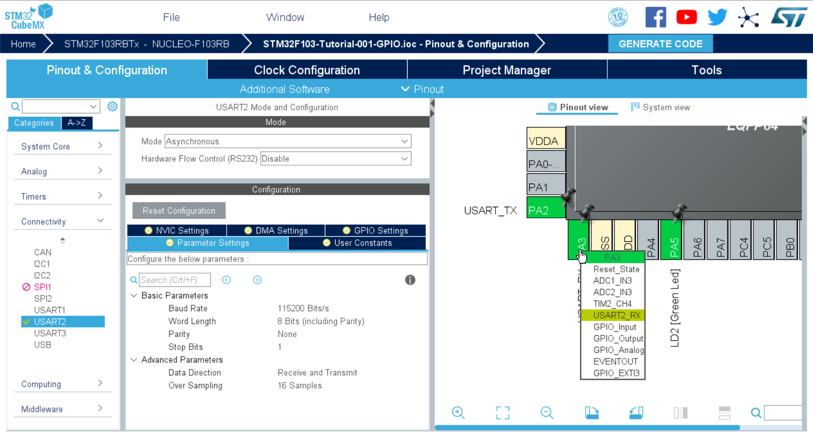
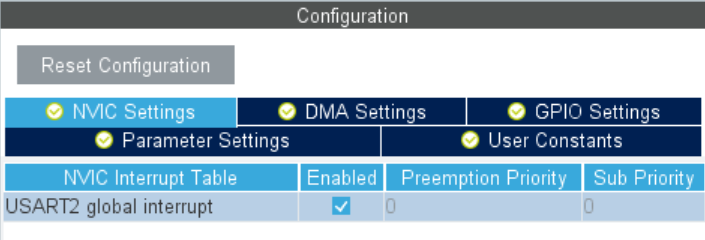
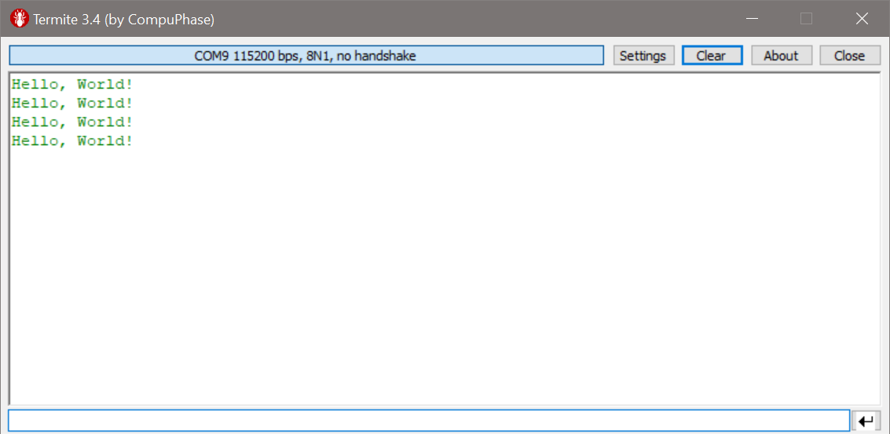

# STM32 Tutoriall 002 - UART Communication

Embedded Software Programming on the STM32 Plattform

---

You can use the STM32CubeMX software to create the necessary configuration files to enable the UART port(s) with the required parameters. 
In this tutorial I’m going to explain how you can use the UART interface to print values using `printf()` and react to user input via UART interrupts.

## Requirements

You need any of the **STM32-Nucleo 64 boards**. I am going to use the `STM32f103rb` board in this tutorial. You should also have an the **STM32CubeMX** Configurator and a compatible IDE installed. Check Tutorial 000 for installation instructions. I will build upon the _Tutorial 001 - GPIO Operations_. It is also handy if you happen to have the User Manual of the Nucleo-64 board and the datasheet for the STM32 microcontroller nearby.

Furthermore, for this tutorial you also need a COM-Terminal emulator like [PuTTY](https://www.putty.org/) or [Termite](https://www.compuphase.com/software_termite.htm). I use Termite in this tutorial.

- [STM32 NUCLEO-F103RB](https://www.st.com/en/evaluation-tools/nucleo-f103rb.html)
- [STM32F103c8 Datasheet](https://www.st.com/resource/en/datasheet/stm32f103c8.pdf)
- STM32 Nucleo-64 boards User Manual **[UM1724](https://www.st.com/content/ccc/resource/technical/document/user_manual/98/2e/fa/4b/e0/82/43/b7/DM00105823.pdf/files/DM00105823.pdf/jcr:content/translations/en.DM00105823.pdf)** (pdf)
- Description of **STM32F1** HAL and low-layer drivers **[UM1850](https://www.st.com/content/ccc/resource/technical/document/user_manual/72/52/cc/53/05/e3/4c/98/DM00154093.pdf/files/DM00154093.pdf/jcr:content/translations/en.DM00154093.pdf)** (pdf)
- STM32CubeMX installed
- arm Keil µVision 5 IDE installed
- (read through _Tutorial 001 - GPIO Operations_)

---

This tutorial comes with the following source code files

- [STM32F103-Tutorial-001-GPIO.ioc](src/STM32F103-Tutorial-001-GPIO.ioc) (STM32CubeMX project file)
- [`main.c`](src/main.c)
- [`stm32f1xx_it.c`](src/stm32f1xx_it.c)

---

## STM32CubeMX Settings

For this tutorial I am using the same file as in the previous tutorial.

If you check the default settings of the `USART2` communication interface, you will see the following settings:



> **Note**: The reason for using the `USART2` interface on GPIO pins `PA2` (`Tx`) and `PA3` (`Rx`) in this example is the following: The `USART2` interface is connected to the STLink/V2 debugger. 
> On your computer it should be connected on one of your `COM` ports (Windows) when you connect the Nucleo board through USB.

For later use of the external interrupt, also make sure to check the `USART2 global interrupt` under the `NVIC Settings`.



Click on `GENERATE CODE` and open the project in Keil µVision 5.

---

## Programm the `printf` function

As we have seen in the previous example, the HAL library offers a couple of functions to use peripheral devices on your STM32 MCU.

If you type `HAL_UART_` and press `Ctrl` + `Space`, it will show you suggestions on functions to use. You can try to print something to the console by typing the following few lines into your `main.c` program.

```c
  /* USER CODE BEGIN WHILE */
  while (1)
  {
    /* USER CODE END WHILE */

    /* USER CODE BEGIN 3 */
        char string[16] = "Hello, World!\n";
        HAL_UART_Transmit(&huart2, string, 14, 10);
        HAL_Delay(1000);
  }
  /* USER CODE END 3 */
```

Please be aware that this code throws `warnings` and is not exactly good practice. However, it shows you how to use the function `HAL_UART_Transmit`.
The HAL Reference manual ([UM1850](https://www.st.com/content/ccc/resource/technical/document/user_manual/72/52/cc/53/05/e3/4c/98/DM00154093.pdf/files/DM00154093.pdf/jcr:content/translations/en.DM00154093.pdf)) lists the full reference for the function on page 556/1208.


The function then has 4 parameters as described above.

To view the output, you need to open your terminal emulator programm.
Use the specified baudrate from the STM32CubeMX settings.



Now, this way of printing information is very unhandy.
A better option is to use the `printf` function from the C standard IO library.
Use the following steps to **redirect the printf output to the UART interface**.

First, you need to include the standard IO C library.

```c
/* Private includes ----------------------------------------------------------*/
/* USER CODE BEGIN Includes */
#include <stdio.h>
/* USER CODE END Includes */
```

Next, you redirect the `printf` to the `USART2` interface using the just discovered `HAL_UART_Transmit` function.

```c
/* Private user code ---------------------------------------------------------*/
/* USER CODE BEGIN 0 */
struct __FILE{
  int handle;
  /* Whatever you require here. If the only file you are using is */
  /* standard output using printf() for debugging, no file handling */
  /* is required. */
};

FILE __stdout;

int fputc(int ch, FILE *f){
    HAL_UART_Transmit(&huart2, (uint8_t *)&ch, 1, 0xFFFF);
  return ch;
}

int ferror(FILE *f){
  /* Your implementation of ferror(). */
  return 0;
}
/* PRINTF REDIRECT to UART END */

/* USER CODE END 0 */
```

Further reading:

- _"How printf to specific USART?"_ [community.arm.com](https://community.arm.com/developer/tools-software/tools/f/keil-forum/34791/how-printf-to-specific-usart)
- _"STM32 printf() redirect"_ [stackoverflow.com](https://stackoverflow.com/questions/45535126/stm32-printf-redirect)

Now you can simply use the `printf` function from your main code as you like.
For example:

```c
  /* USER CODE BEGIN 2 */
    int counter = 0;
  /* USER CODE END 2 */

  /* Infinite loop */
  /* USER CODE BEGIN WHILE */
  while (1)
  {
    /* USER CODE END WHILE */
    /* USER CODE BEGIN 3 */
        printf("Counter is: %d\n", counter);
        counter ++;
        HAL_Delay(1000);
  }
  /* USER CODE END 3 */
```

## Reading UART from Terminal

in `main.c`

```c
/* USER CODE BEGIN PV */
uint8_t rxBuffer;
/* USER CODE END PV */
```

```c
  /* USER CODE BEGIN 2 */
    HAL_UART_Receive_IT(&huart2, &rxBuffer, 1); // start listening for incomming data
  /* USER CODE END 2 */
```

The interrupt will be called after each character (size = 1).

in `stm32f1xx_it.c`

```c
/* Private variables ---------------------------------------------------------*/
/* USER CODE BEGIN PV */
extern UART_HandleTypeDef huart2;
extern uint8_t rxBuffer;
/* USER CODE END PV */
```

```c
/**
  * @brief This function handles USART2 global interrupt.
  */
void USART2_IRQHandler(void)
{
  /* USER CODE BEGIN USART2_IRQn 0 */
    if(__HAL_UART_GET_FLAG(&huart2, UART_FLAG_RXNE)){  // check UART2 Rx Not Empty flag
        HAL_UART_Transmit_IT(&huart2, &rxBuffer, 1);   // ransmit the received data back
    }
  /* USER CODE END USART2_IRQn 0 */
  HAL_UART_IRQHandler(&huart2);
  /* USER CODE BEGIN USART2_IRQn 1 */
    HAL_UART_Receive_IT(&huart2, &rxBuffer, 1);  // restart listening for data
    
    HAL_GPIO_TogglePin(LD2_GPIO_Port, LD2_Pin);  // toggle User LED
  /* USER CODE END USART2_IRQn 1 */
}
```

Further reading:

- STM32F4 Labs [blog.brichacek.net](https://blog.brichacek.net/wp-content/uploads/2015/10/STM32F4-Labs.pdf) (pdf, page 170 ff.)
- HAL: #4 How to - UART Interrupt [youtube.com](https://www.youtube.com/watch?v=xE6GVt7XuJI)

There are several issues with the code above. One being, that this way every other character will go unread as seen in the following picture.


To bypass this, one could use a longer `rxBuffer` of e.g. 10. In order to make this reliable, you have to know the maximum expected message length (e.g. 10).

Another method would be, **polling** for incomming data using `HAL_UART_Receive` (without the IT). A different approach could be to lower the baudrate or to use DMA.


---

**MIT License**

Copyright (c) 2020 Simon Burkhardt / simonmartin.ch / github.com/mnemocron

> Permission is hereby granted, free of charge, to any person obtaining a copy
of this software and associated documentation files (the "Software"), to deal
in the Software without restriction, including without limitation the rights
to use, copy, modify, merge, publish, distribute, sublicense, and/or sell
copies of the Software, and to permit persons to whom the Software is
furnished to do so, subject to the following conditions:

> The above copyright notice and this permission notice shall be included in all
copies or substantial portions of the Software.

> THE SOFTWARE IS PROVIDED "AS IS", WITHOUT WARRANTY OF ANY KIND, EXPRESS OR
IMPLIED, INCLUDING BUT NOT LIMITED TO THE WARRANTIES OF MERCHANTABILITY,
FITNESS FOR A PARTICULAR PURPOSE AND NONINFRINGEMENT. IN NO EVENT SHALL THE
AUTHORS OR COPYRIGHT HOLDERS BE LIABLE FOR ANY CLAIM, DAMAGES OR OTHER
LIABILITY, WHETHER IN AN ACTION OF CONTRACT, TORT OR OTHERWISE, ARISING FROM,
OUT OF OR IN CONNECTION WITH THE SOFTWARE OR THE USE OR OTHER DEALINGS IN THE
SOFTWARE.


